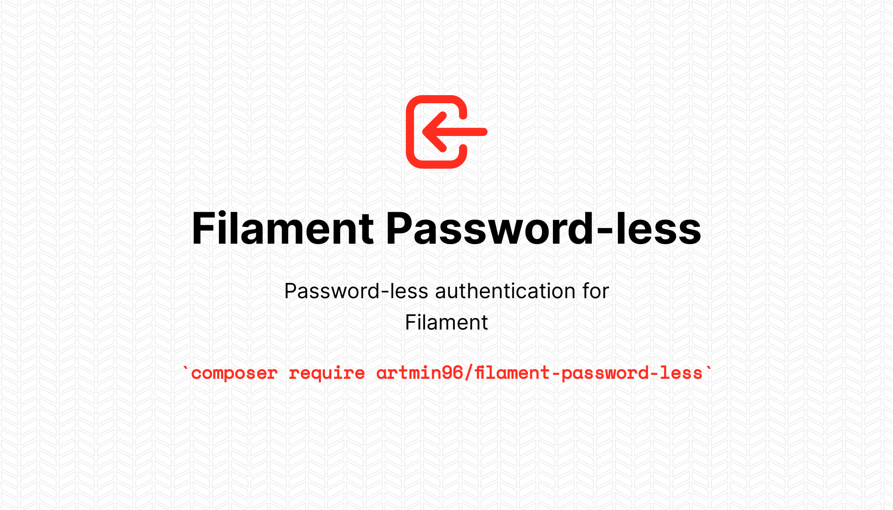
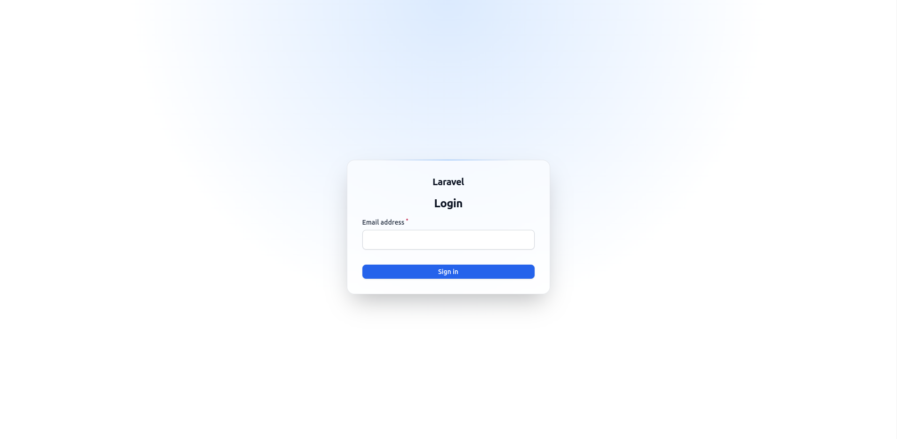
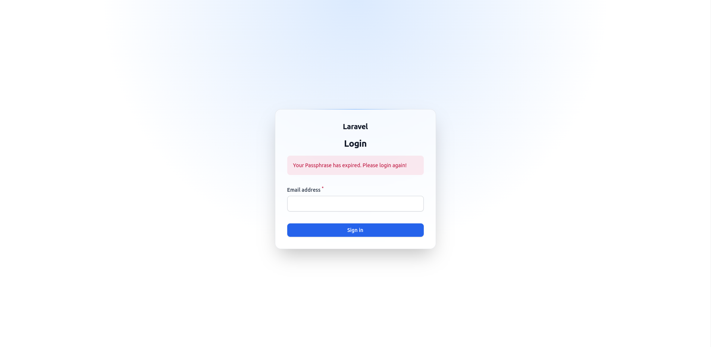
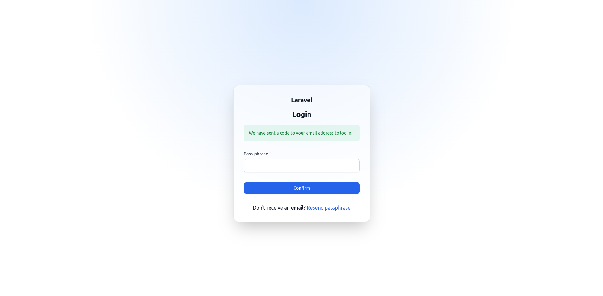
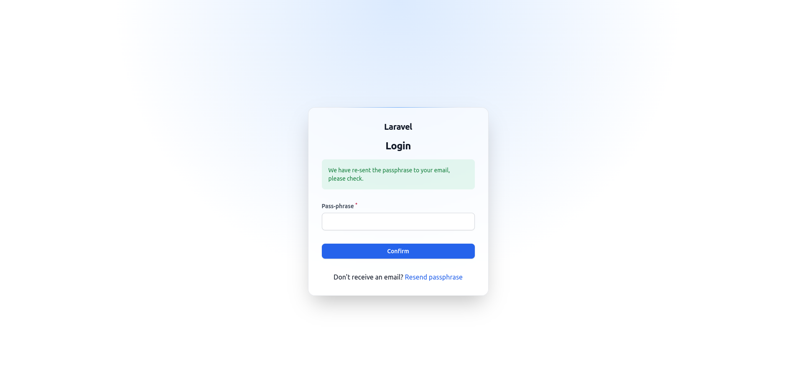

# Password-less login for Filament

[](https://packagist.org/packages/artmin96/filament-password-less)
[](https://github.com/artmin96/filament-password-less/actions?query=workflow%3Arun-tests+branch%3Amain)
[](https://github.com/artmin96/filament-password-less/actions?query=workflow%3A"Check+%26+fix+styling"+branch%3Amain)
[](https://packagist.org/packages/artmin96/filament-password-less)

Password-less authentication is the process of verifying a software user’s identity with something other than a password.

## Screenshots






## Installation

You can install the package via composer:

```bash
composer require artmin96/filament-password-less
```

Update the config/filament.php to point to the PasswordLess Login::class:

```php
'auth' => [
    'guard' => env('FILAMENT_AUTH_GUARD', 'web'),
    'pages' => [
        'login' => \ArtMin96\FilamentPasswordLess\Http\Livewire\Auth\Login::class,
    ],
],
```

You can publish the config file with:

```bash
php artisan vendor:publish --tag="filament-password-less-config"
```

This is the contents of the published config file:

```php
return [
    /**
     * Magic link
     *
     * Maybe you want to log in with a temporary generated link.
     * If yes, set it to true.
     */
    'using_magic_link' => false,

    /**
     * Rate limit count
     */
    'rate_limit_count' => 5,

    /**
     * Passphrase count
     *
     * Passphrase is a combination of 3 or 4 words separated by hyphens.
     */
    'passphrase_count' => 3,

    /**
     * Passphrase expiry (minutes)
     */
    'passphrase_expiry' => 15,

    /**
     * User model
     */
    'user_model' => \App\Models\User::class,

    /**
     * Login confirmation page component
     *
     * If you want to change something, place your component here.
     */
    'confirm_passphrase_component' => \ArtMin96\FilamentPasswordLess\Http\Livewire\Auth\Confirm::class,
];
```

Optionally, you can publish the views using

```bash
php artisan vendor:publish --tag="filament-password-less-views"
```

## Usage

Add the `ArtMin96\FilamentPasswordLess\Traits\PasswordLessLogin` trait to your `User` model(s):

```php
use Illuminate\Foundation\Auth\User as Authenticatable;
use ArtMin96\FilamentPasswordLess\Traits\PasswordLessLogin;

class User extends Authenticatable
{
    use PasswordLessLogin;

    // ...
}
```

## Testing

```bash
composer test
```

## Changelog

Please see [CHANGELOG](CHANGELOG.md) for more information on what has changed recently.

## Contributing

Please see [CONTRIBUTING](https://github.com/ArtMin96/.github/blob/main/CONTRIBUTING.md) for details.

## Security Vulnerabilities

Please review [our security policy](../../security/policy) on how to report security vulnerabilities.

## Credits

- [Arthur Minasyan](https://github.com/ArtMin96)
- [All Contributors](../../contributors)

## License

The MIT License (MIT). Please see [License File](LICENSE.md) for more information.
